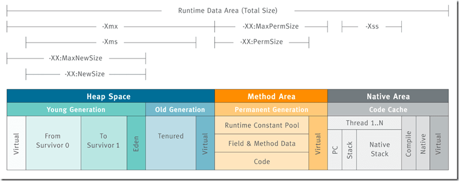

### JVM Memory



#### Memory allocaiton
* -Xms\<heap size>[unit]
* -Xmx\<heap size>[unit]

#### Young Generation allocaiton
* -XX:MaxNewSize\<heap size>[unit]
* -XX:NewSize\<heap size>[unit]


#### MaxDirectMemorySize
* This JVM option specifies the maximum total size of java.nio (New I/O package) direct buffer allocations. It is used with network data transfer and serialization activity.

* To use a direct buffer in Java, we call the allocateDirect() method on ByteBuffer:

```
ByteBuffer directBuf = ByteBuffer.allocateDirect(1024);
```


### JVM Tuning

* Enable Full GC logs for analysis

  * Use the following command-line to turn on Full GC logs:
    ```
    -XX:+PrintGC -XX:+PrintGCDetails -XX:+PrintGCTimeStamps -Xloggc:<filename>
    ```
* Heap Usage monitoring

  * Use monitoring tool like jstat or Java Flight Recorder to check if the heap usage grows indefinitely, which might indicate a bug in your program.

* Choose the right Garbage Collector

  * Garbage-first(G1) Collector
    * Default GC on certain hardware and OS. Can be explicitly enabled through the `-XX:+UseG1GC` option.
    * String deduplication: `-XX:+UseStringDeduplication`. Only supported by G1, and could decrease the heap usage by 10%

  * ZGC
    * Built for applications with huge heaps that require low throughput.
    * Can be enabled through `-XX:+UnlockExperimentalVMOptions -XX:+UseZGC`

 * Other Options:
   * `-XX:MaxGCPauseMillis`: This option specifies the maximum amount of time that the garbage collector is allowed to pause the application.

   * `-XX:UseAdaptiveSizePolicy`: This option tells the JVM to dynamically adjust the size of the young and tenured generations based on the application’s memory usage.

### Reference
* https://developers.redhat.com/articles/2021/11/02/how-choose-best-java-garbage-collector#
  
