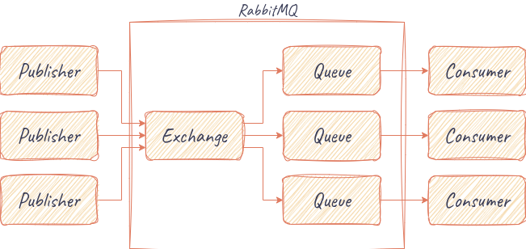

## RabbitMQ

* Built on top of the Advanced Message Queuing Protocol (AMQP)
* Features:
  * Routing: RabbitMQ allows messages to be sent to specific queues based on routing keys, which can be used to filter and route messages to the appropriate recipient.
  * Persistence: RabbitMQ can store messages on disk, ensuring that they are not lost if the server or network fails.
  * Clustering: RabbitMQ can be set up in a cluster, which allows multiple nodes to work together to provide high availability and scalability.
  * Message acknowledgement: RabbitMQ supports message acknowledgement, which means that a sender can be notified when a message has been successfully received by the recipient.
  * Priority queues: RabbitMQ allows messages to be prioritized, which ensures that high-priority messages are processed before lower-priority messages.
  * Plugins: RabbitMQ has a plugin architecture that allows developers to extend its functionality with additional features.
